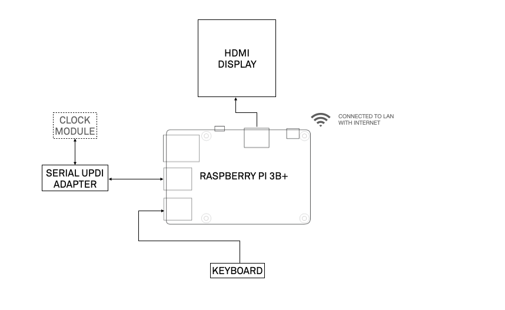

# Preparing the system

### Tested System:

**Raspberry PI 3B+ running raspbian OS Lite**

```text
  `.::///+:/-.        --///+//-:``    pi@firmwareuploader
 `+oooooooooooo:   `+oooooooooooo:    -------------------
  /oooo++//ooooo:  ooooo+//+ooooo.    OS: Raspbian GNU/Linux 10 (buster) armv7l
  `+ooooooo:-:oo-  +o+::/ooooooo:     Host: Raspberry Pi 3 Model B Plus Rev 1.3
   `:oooooooo+``    `.oooooooo+-      Kernel: 5.10.17-v7+
     `:++ooo/.        :+ooo+/.`       Uptime: 4 mins
        ...`  `.----.` ``..           Packages: 549 (dpkg)
     .::::-``:::::::::.`-:::-`        Shell: bash 5.0.3
    -:::-`   .:::::::-`  `-:::-       Terminal: /dev/pts/0
   `::.  `.--.`  `` `.---.``.::`      CPU: BCM2835 (4) @ 1.400GHz
       .::::::::`  -::::::::` `       Memory: 78MiB / 924MiB
 .::` .:::::::::- `::::::::::``::.
-:::` ::::::::::.  ::::::::::.`:::-
::::  -::::::::.   `-::::::::  ::::
-::-   .-:::-.``....``.-::-.   -::-
 .. ``       .::::::::.     `..`..
   -:::-`   -::::::::::`  .:::::`
   :::::::` -::::::::::` :::::::.
   .:::::::  -::::::::. ::::::::
    `-:::::`   ..--.`   ::::::.
      `...`  `...--..`  `...`
            .::::::::::
             `.-::::-`
```


### Hardware wise:




