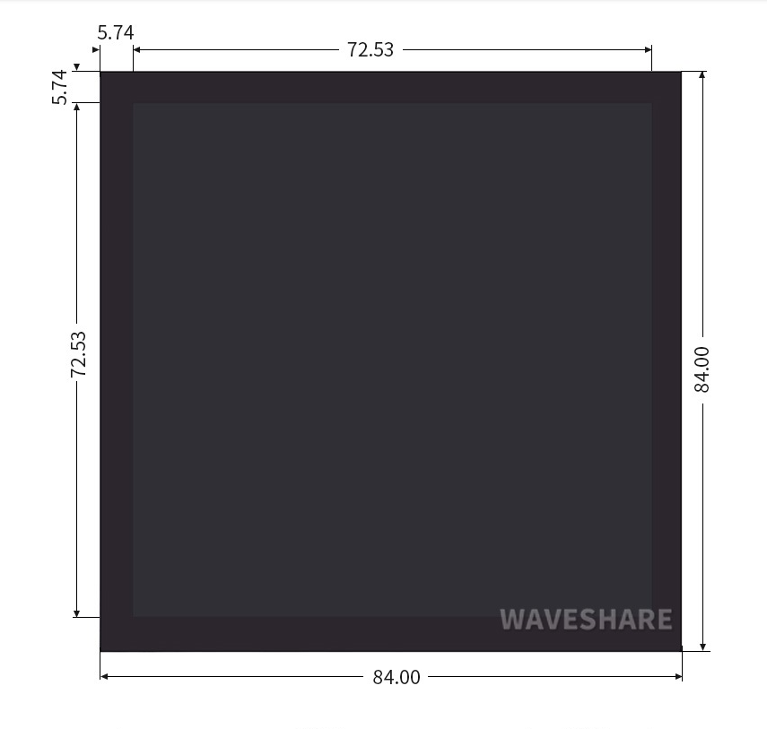

# General First steps ↓

Update and upgrade the system \(if you haven't done already so\): 

```
$ sudo apt-get update -y
$ sudo aot-get upgrade -y
```

> Note: If you are in China, you might need to install a VPN in your raspbian to have quick handshakes with GitHub later. Recommendation for an easy to use cli base VPN would be [**express-vpn**](https://www.expressvpn.com/support/vpn-setup/app-for-raspberry-pi/)**.** 🤨

Next is to Install git:

```bash
$ sudo apt-get install git -y
```

Now check python3 installation and install pip3:

> If it is not installed, update to Python3

```bash
$ which python3
```

This should yield:

```bash
$ /<PATH to Python3>/python3
```

On a first fresh install, if you run:

```bash
$ which pip3
# nothing
```

So install pip3:

```bash
$ sudo apt-get install python3-pip -y
```

To have serial port access from scripts that are run by the current user, in linux, you need to add that user to `dialout` group:

```bash
$ sudo usermod -a -G dialout <USER>
# example: My user is defualt pi
$ sudo usermod -a -G dialout pi
```

### 

### 

### Extra configuration for screen: 

So I have been using, for this terminal a [**4" square display from wave-share**](https://www.waveshare.com/4inch-dpi-lcd-c.htm). It is not a must to have but if you want it as well, the instructions to set-up pi for the display can be found on their [**wiki**](https://www.waveshare.com/wiki/4inch_DPI_LCD_%28C%29)**.** 

> NOTE: I'm not going to be using touch functionality of this screen as for the OS I'm using raspbian Lite  with terminal \[ ! GUI desktop \]. As an alternative I will be using a custom keyboard attached to it. So I will be skipping the touch setup for this.



At the end of the `/boot/config.txt` add the following:

```bash
$ sudo nano /boot/config.txt
```

```bash
gpio=0-9=a2
gpio=12-17=a2
gpio=20-25=a2
dtoverlay=dpi24
enable_dpi_lcd=1
display_default_lcd=1
extra_transpose_buffer=2
dpi_group=2
dpi_mode=87
dpi_output_format=0x7f216
dpi_timings=720 0 46 2 42 720 0 16 2 18 0 0 0 60 0 60000000 6
dtoverlay=waveshare-4dpic-3b-4b
dtoverlay=waveshare-4dpic-3b
dtoverlay=waveshare-4dpic-4b

#Note: For Raspberry Pi 4, you need to comment out dtoverlay=vc4-fkms-V3D.
```

Download the ****[**4inch DPI LCD \(C\) DTBO file**](https://www.waveshare.com/w/upload/0/03/4DPIC_DTBO.zip) and extract _3 dtbo files._

```bash
$ mkdir -p -- Downloads # creates download folder, if it doesn't exist
$ cd Downloads
$ wget https://www.waveshare.com/w/upload/0/03/4DPIC_DTBO.zip
$ unzip 4DPIC_DTBO.zip
$ ls

# OURTPUT:
# $ waveshare-4dpic-3b.dtbo
# $ waveshare-4dpic-3b-4b.dtbo
# $ waveshare-4dpic-4b.dtbo
```

Copy the above three files to the overlays directory `/boot/overlays/`

```bash
# if your download folder doesn't have any other .dtbo files, 
# you can do the following:

$ cp *.dtbo /boot/overlays/
```

