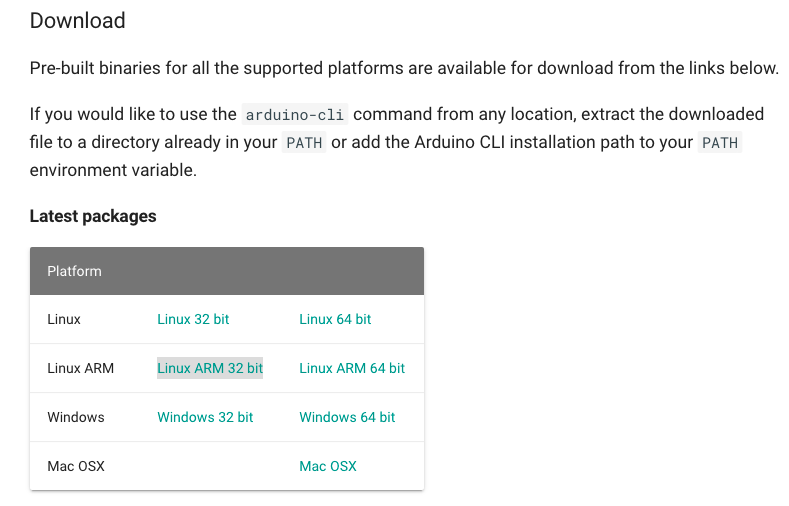

# 2.1 Understanding installer\_settings.yaml

```bash
BINARY:
    LINK: https://downloads.arduino.cc/arduino-cli/arduino-cli_latest_Linux_ARMv7.tar.gz
```

`.BINARY.LINK`: From where it will download the `arduino-cli` binary. It can be found ****[**here**](https://arduino.github.io/arduino-cli/latest/installation/).




```bash
BINARY:
    LINK: https://downloads.arduino.cc/arduino-cli/arduino-cli_latest_Linux_ARMv7.tar.gz
    BASE: /home/pi
```

`.BINARY.BASE`: is the location where you would like to install `arduino-cli.`   

This path information will also be used by our `installer.sh` as: `.BINARY.LINK/bin/arduino-cli`  

> This is important as all the `arduino-cli` based commands will be executed as`/<absolute_path>/arduino-cli` and thus we are not needed to edit any `.bashrc` file to include the binary location in `$PATH`

This information will be also be dded to `programmer_settings.yaml` for the `programmer.sh` to access the `arduino-cli` binary \[ ... more on that later\]. 


```bash
BINARY:
    LINK: https://downloads.arduino.cc/arduino-cli/arduino-cli_latest_Linux_ARMv7.tar.gz
    BASE: /home/pi/test
    CORES:
        LINK:
            - http://drazzy.com/package_drazzy.com_index.json
            - https://dl.espressif.com/dl/package_esp32_index.json
```


