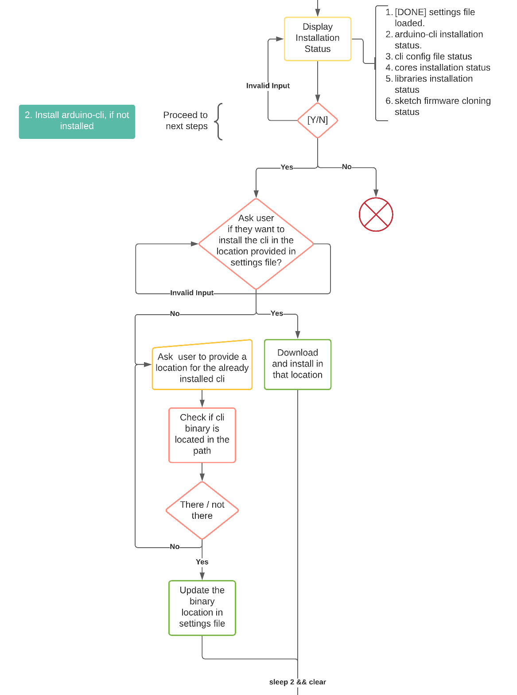

# 2.2 Understanding the installer.sh

When the installer is launched:

```bash
$./installer.sh
```

It launches in interactive mode and shows a list of tasks it needs to process. They are all RED first as nothing is completed.

\[TBD for image\]

For proceeding one step at a time use `[Y/n]`: `y/Y` for next step, `n/N` for quitting the installer. 

The first step being for it is to confirm if `settings_installer.yaml` is there or not. It's really a sanity check. 

Once the file is located, it's going to show you all the info of parsed data like the:

\[TBD image\]

What is happening here is being illustrated below.


 



